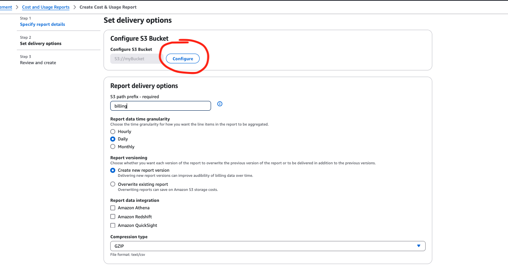
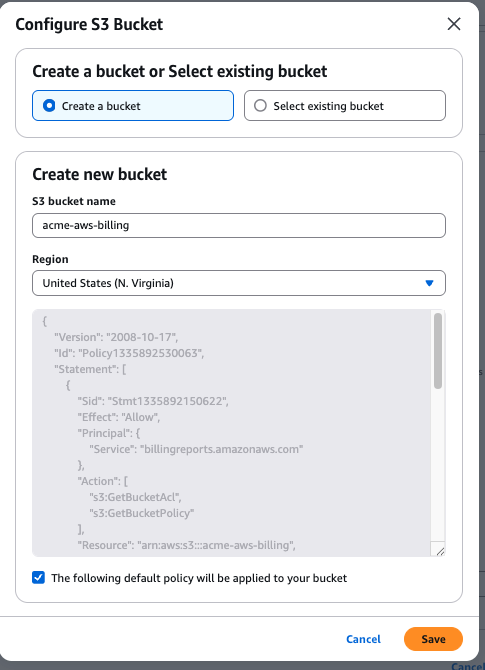

# How do I enable Cost and Usage Report for my AWS Accounts? 

As a best pratice, we recommend you enable Cost and Usage Report in your AWS Accounts. This will ensure that you have a copy of your comprehensive AWS usage data. Though there is no additional charge for enabling this report; you will be paying standard S3 storage rates for the bucket that holds this data.

You can use any name for the bucket, report name and prefix path. DoiT prefers the following values. If you are instructed by your DoiT contact to use specific values, please use those.

>Bucket Name: [YOUR_COMPANY_NAME]-aws-billing (*If you get an error message stating bucket name already exists, add a "-1" suffix to the name*)  
>Report Name: aws-usage-report   
>Prefix: billing  

  

After logging into the AWS Console, navigate to this [page](https://us-east-1.console.aws.amazon.com/billing/home?region=us-east-1#/reports) and click on "Create Report".

You can give any name for the report. Make sure you check the setting "Include Resource Ids" and "Automatically Refresh.."

   
In the next page, we recommend you create a new S3 bucket with proper permissions to store the CUR files. Click on "Configure" to walk through these options.

   

You can select the option of "Create a bucket" and input the name and region.

   

In the next step, you can confirm the recommended policy to the new bucket

   

After pop-up window closes, make sure the other settings are as following.

   

In the next page, you can verify the settings and click "Review and Complete".

Going forward, you will get Cost and Usage Report in the bucket you configured. It can take up to 24 hours for AWS to start delivering reports to your Amazon S3 bucket. After delivery starts, AWS updates the AWS Cost and Usage Reports files at least once a day.  

