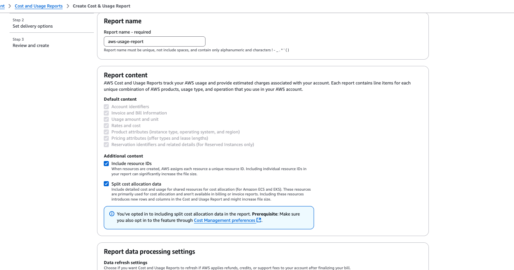

# How do I enable Cost and Usage Report for my AWS Accounts? 

As a best pratice, we recommend you enable Cost and Usage Report in your AWS Accounts. This will ensure that you have a copy of your comprehensive AWS usage data. Though there is no additional charge for enabling this report; you will be paying standard S3 storage rates for the bucket that holds this data.

You have to perform these steps on the [payer/management account](Payer-And-Member-Accounts.md) using the root user or an IAM user with Admin and Billing privileges.

Please follow these [instructions](Is-CUR-enabled.md) to see whether they are already enabled.

You can use any name for the bucket, report name and prefix path. DoiT prefers the following values. If you are instructed by your DoiT contact to use other values, please use those.

>Bucket Name: [YOUR_COMPANY_NAME]-aws-billing (*If you get an error message stating bucket name already exists, add a "-1" suffix to the name*)  
>Report Name: aws-usage-report   
>Prefix: billing  

  

After logging into the AWS Console, navigate to this [page](https://us-east-1.console.aws.amazon.com/billing/home?region=us-east-1#/reports) and click on "Create Report".

Make sure you check the setting "Include Resource Ids" and "Automatically Refresh.."

   
In the next page, we recommend you create a new S3 bucket with proper permissions to store the CUR files. Click on "Configure" to walk through these options.

   

You can select the option of "Create a bucket" and input the name and region.

   

In the next step, you can confirm the recommended policy to the new bucket

   

After pop-up window closes, make sure the other settings are as following.

   

In the next page, you can verify the settings and click "Review and Complete".

Going forward, you will get Cost and Usage Report in the bucket you configured. It can take up to 24 hours for AWS to start delivering reports to your Amazon S3 bucket. After delivery starts, AWS updates the AWS Cost and Usage Reports files at least once a day.  

   
# How do I get reports for past dates?

After 24 hours have passed, you will have the first Cost and Usage Report in your S3 bucket. But, this will be for the current date onwards. AWS can backfill this for past dates, but you need to file a Support Ticket. Please peform following steps.

In AWS Console, navigate to the [Support Page](https://us-east-1.console.aws.amazon.com/support/home), click on "Create Case", Select the following options.

   

In the next page,  Use "CUR file backfilling" for the subject and following text for description. You should mention the beginning date and end dates for the backfill. Mention previous month as the end date. The beginning date can be a month/year three years prior to the previous month.

 

    Hello,
    
    I've just recently enabled CUR files in my account. Can you please have this backfilled for previous dates?
    
    
    report name: <Use-your-report-name-from-above>
    dates: YYYY/MM - YYYY/MM

    Thanks in advance.

In the next page, you can select any of the options for "contact us". We recommend you click "Web" and add your DoiT contacts in the "Additional Contacts" field. AWS Support Team will get back to you with in 12 hours. Backfilling process usually takes a few days.

