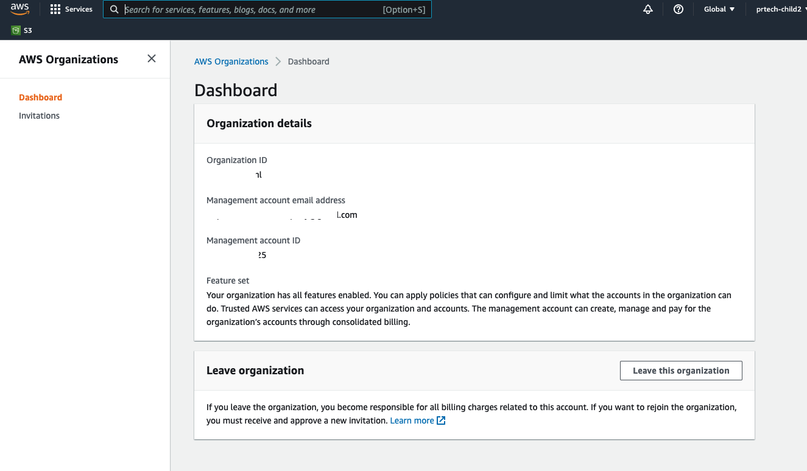
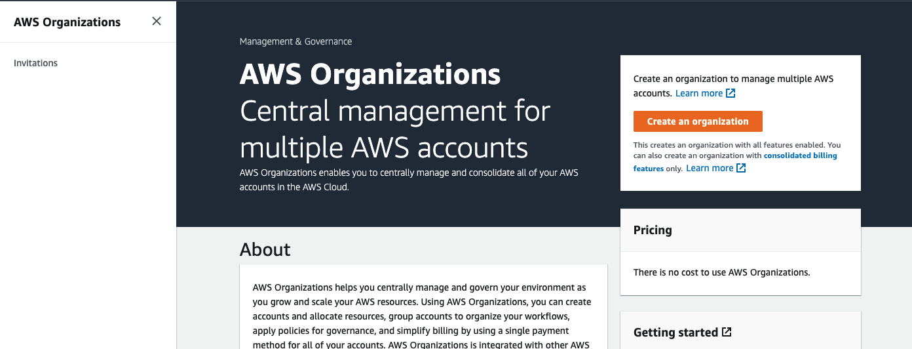
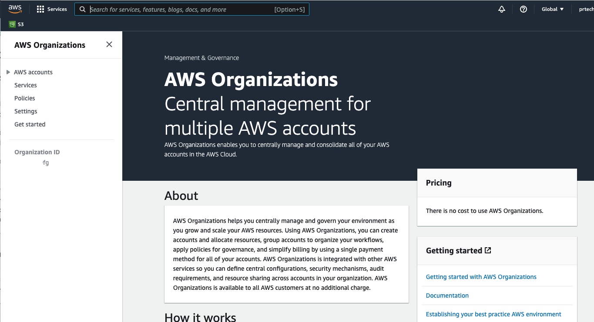
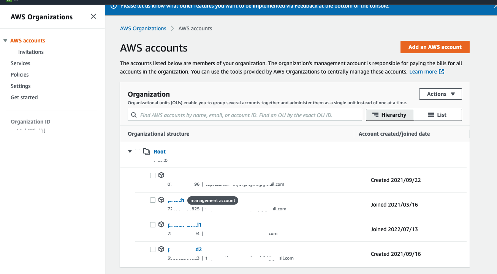

# Payer Account and Member Accounts

As per [AWS terminology](https://docs.aws.amazon.com/organizations/latest/userguide/orgs_getting-started_concepts.html), a **payer account** (also referred to as **management account** or **master account**) is the AWS account where you manage an AWS Organization and pay a consolidated invoice for all the member accounts.  

  

# How to find whether the account you are using is a payer/management account or a member account?

We recommend you do the following as the Root User or an IAM User with admin privilleges. If you get a message stating that "You don't have permissions to access this resource", your IAM user is not privilleged enough to check this information. 

After logging into the AWS Console, navigate to this [page](https://us-east-1.console.aws.amazon.com/organizations/v2/home/dashboard).

If you see a page similar to following, you are currently in a member account. 
  

   

If you see page similar to following, you are currently in a payer/management account. But, it's a standalone account and there is no Organization or member accounts assoicated with it.
  

   

If you see page similar to following, you are currently in a payer/management account. It has an Organization with member accounts associated with it.
  

   

In order to see what all member accounts are associated with it, you can click on "AWS Accounts" and you will something similar to following
  

   

# I found out that I'm using a member account. How do I find out the corresponding payer/management account?

This [page](https://us-east-1.console.aws.amazon.com/organizations/v2/home/dashboard) mentions the root email address associated with the payer/management account. Search in your company's vault/password-manager to see whether you see an AWS Console login entry corresponding to that. You can also email the root user asking for more details. If the email corresponds to a third-party or a different company, it implies that you are currently purchasing your AWS services from a Reseller or MSP. In this case, you may not have access to your payer/managemnt account. Please mention this to your DoiT Contact.

